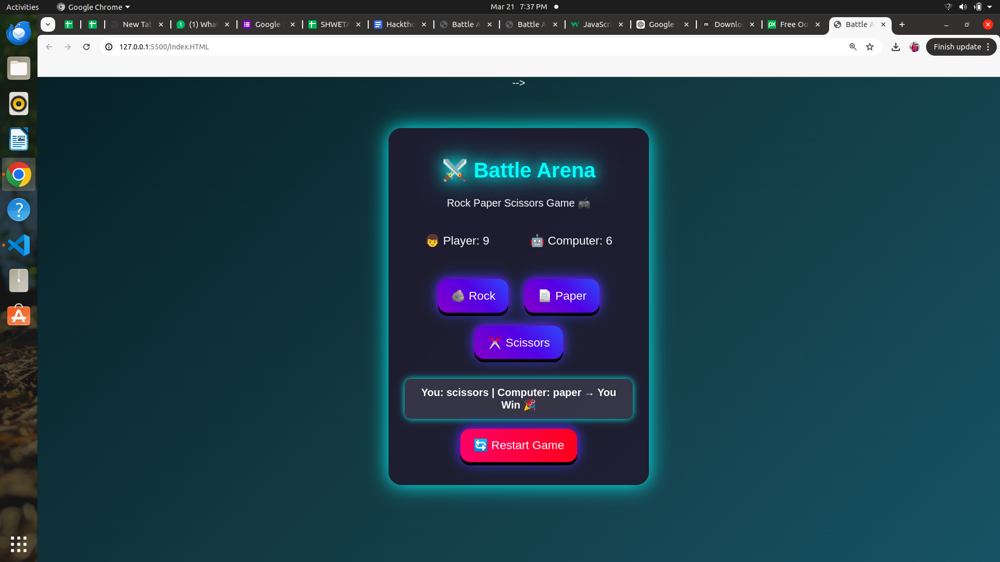

# 🎮 Rock Paper Scissors Game

##  Project Description
This is an interactive Rock Paper Scissors game built using HTML, CSS, and JavaScript. The game allows a player to compete against the computer with real-time score updates and animations.

##  Features
- Player vs Computer gameplay
- Score tracking
- Local Storage (score saving)
- Sound effects
- Emoji animations
- Responsive design

## Technologies Used
- HTML5
- CSS3
- JavaScript

##  How to Run
1. Open index.html in browser
2. Click Rock, Paper, or Scissors
3. See results and score updates

##  Deployment
Project can be hosted using:
- GitHub Pages
- Netlify

##  Screenshots
(Add screenshots here)

## 👩 Author
Shweta gate 